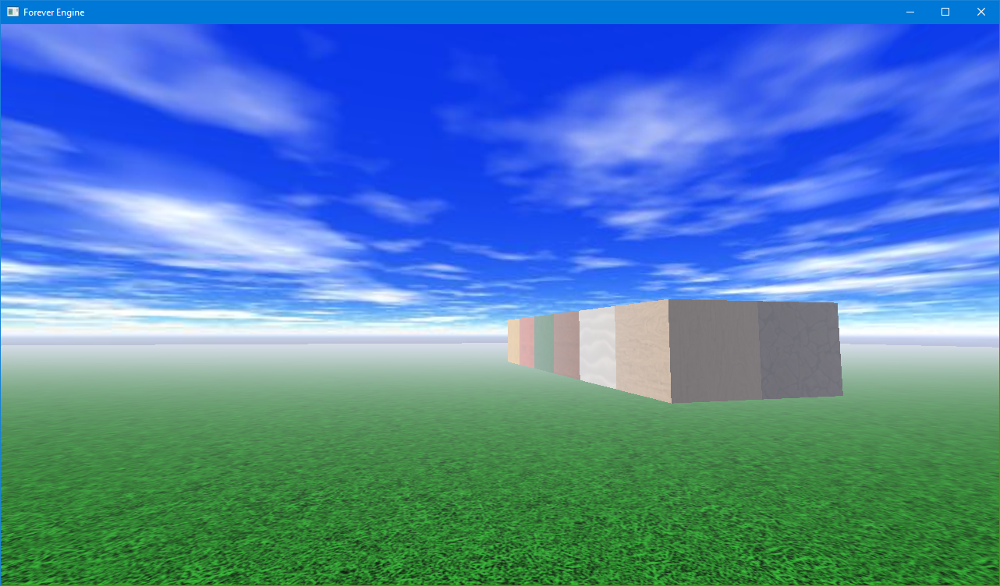
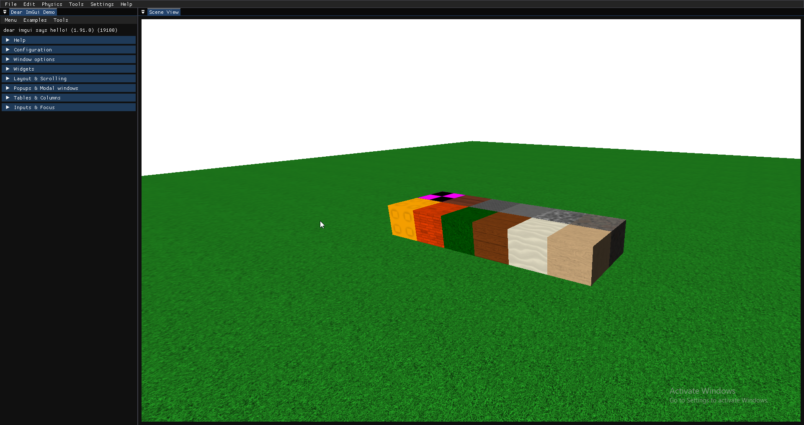

# Forever Engine (likely nonfunctional)

Old files from August '24 -> October '24 I stopped working on. Made with C#, OpenTK and ImGui bindings. Aimed to emulate old roblox?

## Bindings Sermon

Here ye, here ye, listen to my sermon. When I wrote the core components of this engine, I thought using C# bindings of C++ libraries would be a breeze. Turns out, there were so many ambiguous errors and bugs that made it awful to work with. Especially since, there aren't even that many great tutorial resources IN THE ORIGINAL LANGUAGE these libraries were written for about things I was going for.

### ImGuizmo

One giant hurdle I tried for ages to get over (and never ended up getting over!) is getting an ImGuizmo binding to work with this project. Not only did this cause probably 2 weeks~ worth of anger (after those 2 weeks I quit trying and you see the project in its current state) but even then after I hypothetically got it to build and then it runs, god knows one minor mistake with little documentation means you crash and get an extremely vague error.

I should have used C++, which I didn't use because I felt the end developer does too much work getting things done (I was also doing this mostly before school during the very early morning or later in the evening, as well as consuming most of my weekends :P so my philosophy here might be a little skewed.) but I now realize is beneficial because you have full control over virtually... everything. Especially when using low level libraries like OpenGL.

### Dear ImGui

Another hurdle is the configurability of Dear ImGui as a ui library. Good for debug UIs (as the author stated) and not great for end user ui. Just integrate your engines with Qt or Wx or something. I love Qt mainly because it's so easy to deck out a Designer file and make it look nice. From what I've seen it also pairs pretty nicely with 3d rendering libraries like OpenGL or DirectX. 

## License 
This project and all of its assets are licensed under the [GNU General Public License v3.0](https://github.com/harnessyourhopes/Forever-Engine/blob/main/LICENSE).
